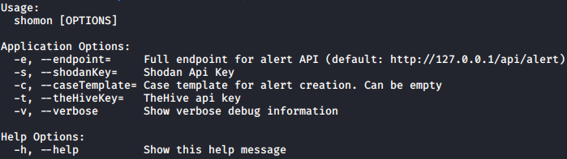

# 

ShoMon is a shodan alert feeder for theHive written in GoLang. Takes advantage of Golang's goroutines with deferred recover to continuously monitor alerts from shodan and feed them into theHive as alerts.

# Usage
   

## Notes
* Logs can be found in shodanmonitor.log under the same folder
* Alert reference is md5("ip:port")
* Default logging level is DEBUG. Can be changed via editing logwrapper

# Setup & Compile Instructions
## Get latest compiled binary from releases
1. Check [Releases] section.

## Compile from source code
1. Make sure that you have a working Golang workspace.
2. `go build .`
    * `go build -ldflags="-s -w" .` could be used to customize compilation and produce smaller binary.

## Using Dockerfile
1. `docker build -t shomon .`
2. `docker run -it shomon -s {SHODANKEY} -t {THEHIVEKEY}`

# Credits
* Logo Made via LogoMakr.com
* `go-shodan` : https://github.com/ns3777k/go-shodan
* logwrapper package : https://www.datadoghq.com/blog/go-logging/
* Dockerfile : https://www.cloudreach.com/en/resources/blog/cts-build-golang-dockerfiles/

[Releases]: https://github.com/KaanSK/shomon/releases/latest
